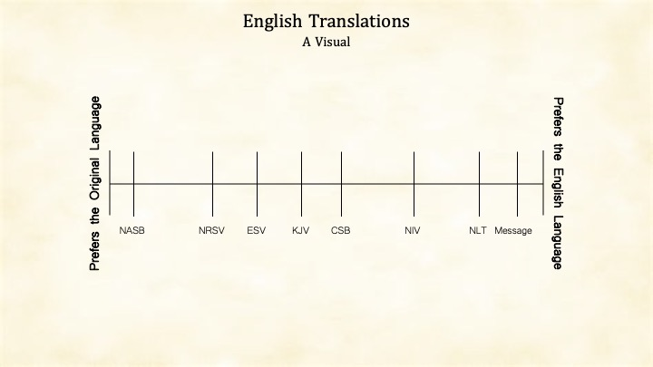

It is common to think of Bible translations to be on a scale. A visual scale is helpful when thinking about where a specific translation lands on translation philosophy. I've created a scaled visual below that comes to mind when I think about translations.

It is important to note that the position of the translation on the scale is not a statement of quality. The scale reflects my opinion of the relationship between translations, not their relationship to an idealistic scale.

